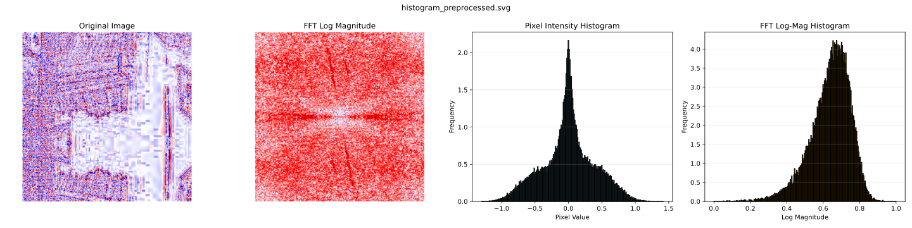
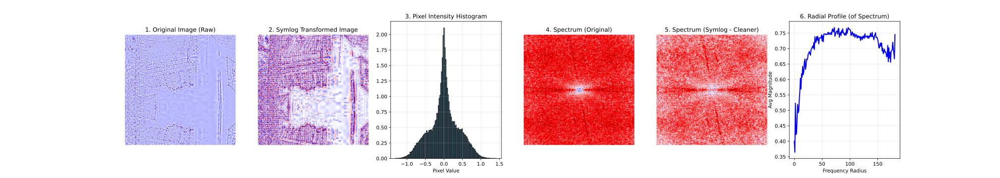
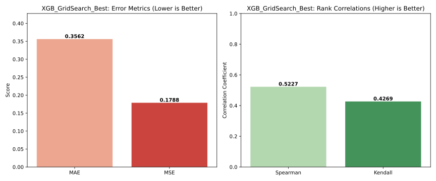
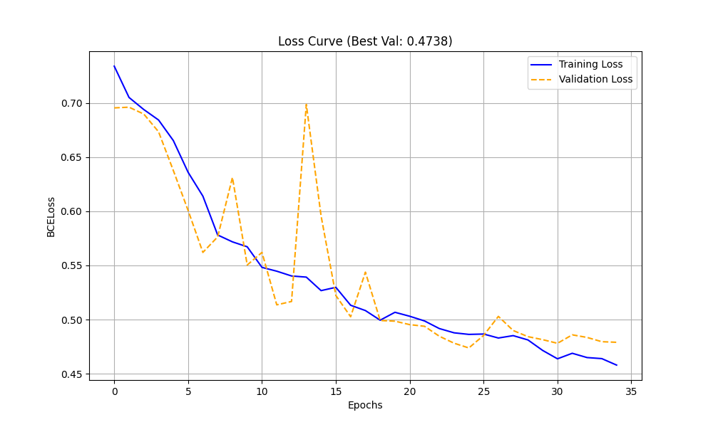

# Project Report: Image Noise Distribution Matching

**Course:** Practical Machine Learning\
**Student:** Dumitrescul Eduard-Valentin\
**Group:** 412

-----

## 1\. Introduction

The objective of this project is to develop a machine learning solution capable of 
distinguishing between noise images coming from different distributions.

This report documents the end-to-end process, starting from exploratory data analysis and feature engineering, moving through the training of classical machine learning models  based on statistical features, and concluding with a Deep Learning approach (CNN). The performance of these models is evaluated using Mean Absolute Error (MAE), Mean Squared Error (MSE), and rank correlation coefficients (Spearman and Kendall) on a validation dataset.

## 2\. Data Analysis and Preprocessing

### 2.1 Dataset Overview

The dataset consists of a collection of images stored in `.npy` (numpy array) format, accompanied by CSV files containing labels for training, validation, and testing.

  * **Train Set:** 6078 labeled pairs
  * **Validation Set:** 1800 labeled pairs
  * **Test Set:** 4104 unlabeled pairs

    

Initial analysis shows that the data is well-split. The labels are evenly distributed, so no further balancing is required.

### 2.2 Global Statistics

**Summary Metrics**
* **Mean:** 0.03
* **Standard Deviation:** 1.88
* **Range:** -59.0 (Min) to 56.25 (Max)

**Key Observations**

* **Min/Max Distributions:** The histograms for both Minimum and Maximum values show two clear peaks. This structure suggests these extreme values capture significant variance, indicating they could serve as features for the model.
* **Mean Distribution:** The global mean is approximately 0 ($0.03$). As shown in the "Distribution of Image Means," the data is heavily concentrated near zero with a long tail, showing no other discernible patterns.
* **Standard Deviation:** The standard deviation falls within the range of $[0, 3.5]$. Similar to the min/max values, the standard deviation histogram displays two peaks. This bimodal shape implies a potential correlation between the noise distribution and the image contrast (standard deviation).

    

### 2.2 Data Preprocessing

Images were loaded from the `samples` directory. Since the data is stored as raw numpy arrays, the following preprocessing steps were applied:

**Symlog Transformation:** As observed in the exploratory phase, the raw pixel values showed a high dynamic range. A symmetric logarithmic transformation (`symlog`) was applied to the raw data during the feature extraction phase to suppress outliers and make the distribution of pixel intensities more Gaussian-like.
    $$f(x) = sign(x) \cdot \log_{10}(|x| + 1)$$

| Metric | Before | After | Change |
| :--- | :--- | :--- | :--- |
| **Mean** | $0.0006$ | $0.0030$ | $\approx 0$ (Centering maintained) |
| **Std Dev** | $2.2955$ | $0.3885$ | **Decreased** (Variance reduced) |
| **Min** | $-19.1250$ | $-1.3037$ | Range Compressed |
| **Max** | $25.3438$ | $1.4207$ | Range Compressed |
| **Kurtosis** | $6.4418$ | $0.0513$ | **Drastic Drop** (Distribution flattened) |
| **Skew** | $-0.0720$ | $-0.0720$ | **Identical** (Symmetry preserved) |
| **Entropy** | $4.0683$ | $14.1598$ | **Increased** (Higher information density) |

    

Preprocessing significantly enhances the visibility of underlying patterns.

## 3\. Feature Engineering

### 3.1 Magnitude Spectrum

We developed a diagnostic tool to evaluate image frequency content before and after preprocessing. The pipeline consists of the following steps:
* **Transformation:** Utilized `numpy.fft.fft2` to compute the discrete Fourier transform, converting images from spatial pixels to frequency components.
* **Centralization:** Applied `fftshift` to move the zero-frequency component to the center of the image for standard visualization.
* **Logarithmic Scaling:** Implemented a log-transformation to attenuate dominant low-frequency energy, thereby revealing high-frequency textures and potential scanning artifacts.
* **Normalization:** Rescaled all spectral magnitudes to $[0, 1]$ to ensure consistent contrast across different samples.
* **Comparison:** The analysis was generated for both raw and `symlog`-transformed images to verify that preprocessing preserves essential structural information while handling noise.

    

### 3.2 Radial Profile

To simplify the complex information found in the 2D frequency maps, we implemented a **Radial Profile Analysis**. This technique reduces the 2D spectrum into a clear 1D line graph, making it easier to identify trends and anomalies.

**The Algorithm (Radial Averaging)**
The process can be visualized as drawing a series of expanding, concentric rings around the center of the spectrum (the DC component).
1.  **Distance Calculation:** For every pixel in the frequency map, the algorithm calculates its distance from the center.
2.  **Averaging:** It then calculates the average brightness (magnitude) of all pixels located within each ring.
3.  **Result:** This produces a single plot showing the **Average Magnitude** versus **Frequency (Radius)**.

**Interpretation**
This 1D profile allows for immediate visual diagnosis:
* **Natural Decay:** In healthy images, the line should drop smoothly as frequency increases (following a natural power law).
* **Artifact Detection:** Sudden spikes or bumps in the line indicate specific, repetitive noise frequencies that might not be obvious in the 2D image.

    

### 3.3 Pixel Value Histogram

To reduce the complex spatial data into a one-dimensional statistical summary, we calculated pixel intensity histograms using 128 bins.

    

### 3.4 Full Feature Set Visualization

Simple values: mean, standard deviation, min pixel value, max pixel value, kurtosiss,skewness, entropy

More complex features: pixel value histogram, spectrum, radial profile

    

## 4. XGBoost

An **XGBoost Classifier** was selected for the learning task due to its efficiency with tabular data and ability to model non-linear interactions. 

### 4.1. Feature Extraction Pipeline
To capture the distinct characteristics of each image, a dedicated feature extraction function (`get_feature_vector`) was implemented. This function aggregates multiple features to create comprehensive input for the model.

The input consists of the concatenation of the following features:
* Statistics of the original image
* Statistics of the preprocessed image
* Pixel value histogram
* Radial Profile

### 4.2. Pairwise Dataset Construction
The core of the classification task involves comparing two images to determine their relationship (labeled in the dataset). The `build_dataset` function generates the training data by combining the feature vectors of two images ($f_1$ and $f_2$) using interaction terms:

> **Feature Combination Strategy:**
> To ensure the model captures both the individual properties of the images and the relationship between them, the final input vector is constructed by concatenating:
> * The raw features of both images ($f_1, f_2$)
> * The absolute difference ($|f_1 - f_2|$) to measure distance/divergence.
> * The element-wise product ($f_1 \cdot f_2$) to capture interaction and correlation.

### 4.3 Manual Tuning

After some manual testing, this was the best performing model configuration:

* **Preprocessing:** All input features are normalized using `StandardScaler` to ensure zero mean and unit variance, facilitating stable convergence.
* **Hyperparameters:** The model is configured with 1000 estimators, a learning rate of 0.05, and a maximum depth of 6 to balance model complexity and generalization.
* **Optimization:** Training utilizes **early stopping** (patience of 200 rounds) based on the validation set performance to prevent overfitting.

This model achieved the following results:
* **Validation Accuracy: 70.5%**
* **Validation AUC: 0.79**

### 4.4 Grid Search Hyperparameter Tuning

**Tuned Parameters:**
Here is the drafted section for your project report. I have formatted the parameters into descriptions as requested and organized the configuration data into a readable format suitable for a technical report.

### 4.4 Grid Search Hyperparameter Tuning

To optimize the model's performance and mitigate overfitting, we employed a Grid Search strategy. This method systematically explores a defined combination of hyperparameters to identify the configuration that yields the best evaluation metric.

**Tuned Parameters**
The following hyperparameters were selected for tuning to balance model complexity and generalization capabilities:

* **learning_rate:** It is tuned to ensure the model converges efficiently without overshooting the optimal solution.
* **max_depth:** It si tuned toapture complex non-linear patterns while restricting the tree's depth to prevent overfitting.
* **min_child_weight:** It is tuned to control the algorithm's conservatism, ensuring the model does not learn highly specific patterns representing noise.
* **subsample:** It is tuned to introduce randomness (row subsampling), which helps reduce variance and prevent overfitting.
* **colsample_bytree:** It is tuned to ensure feature diversity and prevent the model from relying too heavily on a subset of dominant features.

**Search Space Configuration**\
The Grid Search was executed over the following parameter space (72 configurations):

| Hyperparameter | Values Tested |
| :--- | :--- |
| **learning_rate** | `0.01`, `0.05`, `0.1` |
| **max_depth** | `4`, `6`, `8` |
| **min_child_weight** | `1`, `5` |
| **subsample** | `0.6`, `0.8` |
| **colsample_bytree** | `0.7`, `1.0` |

**Static Configuration**
To ensure computational efficiency during the extensive search process, specific parameters were held constant across all runs. Notably, `early_stopping_rounds` was set to 50 to prune non-improving iterations quickly.

* **n_estimators:** 1000
* **early_stopping_rounds:** 50
* **n_jobs:** -1 (Utilizing all available processors)
* **eval_metric:** 'logloss'
* **random_state:** 42 (For reproducibility)

### Grid Search Results 

| Iter | ColSamp | LR | Depth | Child_W | Sub | Accuracy | AUC |
| :--- | :--- | :--- | :--- | :--- | :--- | :--- | :--- |
| 1 | 0.7 | 0.01 | 4 | 1 | 0.6 | 0.6794 | 0.7581 |
| 2 | 0.7 | 0.01 | 4 | 1 | 0.8 | 0.6906 | 0.7646 |
| 3 | 0.7 | 0.01 | 4 | 5 | 0.6 | 0.6856 | 0.7584 |
| 4 | 0.7 | 0.01 | 4 | 5 | 0.8 | 0.6906 | 0.7634 |
| 5 | 0.7 | 0.01 | 6 | 1 | 0.6 | 0.7000 | 0.7845 |
| 6 | 0.7 | 0.01 | 6 | 1 | 0.8 | 0.7133 | 0.7931 |
| 7 | 0.7 | 0.01 | 6 | 5 | 0.6 | 0.6967 | 0.7809 |
| 8 | 0.7 | 0.01 | 6 | 5 | 0.8 | 0.7044 | 0.7838 |
| 9 | 0.7 | 0.01 | 8 | 1 | 0.6 | 0.7128 | 0.7964 |
| **10** | **0.7** | **0.01** | **8** | **1** | **0.8** | **0.7122** | **0.8005** |
| 11 | 0.7 | 0.01 | 8 | 5 | 0.6 | 0.7067 | 0.7942 |
| 12 | 0.7 | 0.01 | 8 | 5 | 0.8 | 0.7139 | 0.7935 |
| 13 | 0.7 | 0.05 | 4 | 1 | 0.6 | 0.6989 | 0.7781 |
| 14 | 0.7 | 0.05 | 4 | 1 | 0.8 | 0.6889 | 0.7768 |
| 15 | 0.7 | 0.05 | 4 | 5 | 0.6 | 0.6983 | 0.7658 |
| 16 | 0.7 | 0.05 | 4 | 5 | 0.8 | 0.6978 | 0.7796 |
| 17 | 0.7 | 0.05 | 6 | 1 | 0.6 | 0.7044 | 0.7821 |
| 18 | 0.7 | 0.05 | 6 | 1 | 0.8 | 0.7094 | 0.7923 |
| 19 | 0.7 | 0.05 | 6 | 5 | 0.6 | 0.7000 | 0.7771 |
| 20 | 0.7 | 0.05 | 6 | 5 | 0.8 | 0.7033 | 0.7900 |
| 21 | 0.7 | 0.05 | 8 | 1 | 0.6 | 0.6950 | 0.7814 |
| 22 | 0.7 | 0.05 | 8 | 1 | 0.8 | 0.7106 | 0.7900 |
| 23 | 0.7 | 0.05 | 8 | 5 | 0.6 | 0.7017 | 0.7809 |
| 24 | 0.7 | 0.05 | 8 | 5 | 0.8 | 0.7078 | 0.7869 |
| 25 | 0.7 | 0.1 | 4 | 1 | 0.6 | 0.6850 | 0.7675 |
| 26 | 0.7 | 0.1 | 4 | 1 | 0.8 | 0.6950 | 0.7748 |
| 27 | 0.7 | 0.1 | 4 | 5 | 0.6 | 0.6894 | 0.7627 |
| 28 | 0.7 | 0.1 | 4 | 5 | 0.8 | 0.6972 | 0.7694 |
| 29 | 0.7 | 0.1 | 6 | 1 | 0.6 | 0.7006 | 0.7837 |
| 30 | 0.7 | 0.1 | 6 | 1 | 0.8 | 0.6928 | 0.7740 |
| 31 | 0.7 | 0.1 | 6 | 5 | 0.6 | 0.6889 | 0.7677 |
| 32 | 0.7 | 0.1 | 6 | 5 | 0.8 | 0.6922 | 0.7795 |
| 33 | 0.7 | 0.1 | 8 | 1 | 0.6 | 0.6967 | 0.7722 |
| 34 | 0.7 | 0.1 | 8 | 1 | 0.8 | 0.7033 | 0.7895 |
| 35 | 0.7 | 0.1 | 8 | 5 | 0.6 | 0.6978 | 0.7752 |
| 36 | 0.7 | 0.1 | 8 | 5 | 0.8 | 0.6911 | 0.7797 |
| 37 | 1.0 | 0.01 | 4 | 1 | 0.6 | 0.6839 | 0.7613 |
| 38 | 1.0 | 0.01 | 4 | 1 | 0.8 | 0.6911 | 0.7638 |
| 39 | 1.0 | 0.01 | 4 | 5 | 0.6 | 0.6794 | 0.7587 |
| 40 | 1.0 | 0.01 | 4 | 5 | 0.8 | 0.6894 | 0.7645 |
| 41 | 1.0 | 0.01 | 6 | 1 | 0.6 | 0.7022 | 0.7849 |
| 42 | 1.0 | 0.01 | 6 | 1 | 0.8 | 0.7094 | 0.7898 |
| 43 | 1.0 | 0.01 | 6 | 5 | 0.6 | 0.7000 | 0.7805 |
| 44 | 1.0 | 0.01 | 6 | 5 | 0.8 | 0.7072 | 0.7850 |
| 45 | 1.0 | 0.01 | 8 | 1 | 0.6 | 0.7078 | 0.7936 |
| 46 | 1.0 | 0.01 | 8 | 1 | 0.8 | 0.7133 | 0.7995 |
| 47 | 1.0 | 0.01 | 8 | 5 | 0.6 | 0.7083 | 0.7897 |
| 48 | 1.0 | 0.01 | 8 | 5 | 0.8 | 0.7133 | 0.7923 |
| 49 | 1.0 | 0.05 | 4 | 1 | 0.6 | 0.6922 | 0.7752 |
| 50 | 1.0 | 0.05 | 4 | 1 | 0.8 | 0.7061 | 0.7847 |
| 51 | 1.0 | 0.05 | 4 | 5 | 0.6 | 0.6950 | 0.7706 |
| 52 | 1.0 | 0.05 | 4 | 5 | 0.8 | 0.6983 | 0.7763 |
| 53 | 1.0 | 0.05 | 6 | 1 | 0.6 | 0.6833 | 0.7733 |
| 54 | 1.0 | 0.05 | 6 | 1 | 0.8 | 0.7083 | 0.7932 |
| 55 | 1.0 | 0.05 | 6 | 5 | 0.6 | 0.6900 | 0.7724 |
| 56 | 1.0 | 0.05 | 6 | 5 | 0.8 | 0.7094 | 0.7908 |
| 57 | 1.0 | 0.05 | 8 | 1 | 0.6 | 0.6950 | 0.7836 |
| 58 | 1.0 | 0.05 | 8 | 1 | 0.8 | 0.6967 | 0.7857 |
| 59 | 1.0 | 0.05 | 8 | 5 | 0.6 | 0.6967 | 0.7783 |
| 60 | 1.0 | 0.05 | 8 | 5 | 0.8 | 0.7083 | 0.7894 |
| 61 | 1.0 | 0.1 | 4 | 1 | 0.6 | 0.6811 | 0.7479 |
| 62 | 1.0 | 0.1 | 4 | 1 | 0.8 | 0.6922 | 0.7667 |
| 63 | 1.0 | 0.1 | 4 | 5 | 0.6 | 0.6894 | 0.7661 |
| 64 | 1.0 | 0.1 | 4 | 5 | 0.8 | 0.7022 | 0.7823 |
| 65 | 1.0 | 0.1 | 6 | 1 | 0.6 | 0.6950 | 0.7814 |
| 66 | 1.0 | 0.1 | 6 | 1 | 0.8 | 0.6944 | 0.7767 |
| 67 | 1.0 | 0.1 | 6 | 5 | 0.6 | 0.6778 | 0.7628 |
| 68 | 1.0 | 0.1 | 6 | 5 | 0.8 | 0.6922 | 0.7747 |
| 69 | 1.0 | 0.1 | 8 | 1 | 0.6 | 0.6994 | 0.7830 |
| 70 | 1.0 | 0.1 | 8 | 1 | 0.8 | 0.6944 | 0.7765 |
| 71 | 1.0 | 0.1 | 8 | 5 | 0.6 | 0.6861 | 0.7672 |
| 72 | 1.0 | 0.1 | 8 | 5 | 0.8 | 0.7056 | 0.7854 |

### Best Model Results

* **Accuracy**: 71.22%
* **AUC**: 0.8005
* **Public Test Accuracy**: 77.11%

    

## 5. Siamese Network
Here is the completed section for your project report, drafted with medium-complexity wording and succinct descriptions as requested.

## 5. Siamese Network

The core of our approach utilizes a Siamese Neural Network architecture. Unlike traditional classification models, this network consists of two identical sub-networks that share the same weights and parameters. The primary objective is to learn a similarity function by mapping input pairs into a common feature space. During the forward pass, two distinct images are processed by the shared sub-networks to produce feature vectors. The network then computes the distance between these vectors to determine the degree of similarity, outputting a probability score indicating whether the inputs belong to the same class.

### 5.1 Feature Extraction Pipeline
To prepare the raw data for the network, we implemented two distinct preprocessing strategies to enhance feature perceptibility:

* **Option 1: SymLog Transformation**
    We apply a Symmetric Logarithmic (SymLog) transformation to the raw images. 
* **Option 2: Magnitude Spectrum and SymLog Tranformation**
    This pipeline extends the first option by computing the magnitude spectrum of the SymLog-transformed images and concatenating the two.

### 5.2 Data Augmentation
To mitigate overfitting and improve the model's generalization capabilities, the following geometric transformations are applied during training:

* **Horizontal/Vertical Flipping** 
* **90-Degree Rotation**

### 5.3 Model Architecture
The architecture is designed to handle $256 \times 256$ single-channel inputs. It utilizes a Convolutional Neural Network (CNN) as the feature extractor, followed by an L1 distance calculation and a fully connected classifier head.

**Table: Detailed Layer Configuration**

| Layer / Block | Input Shape $(C, H, W)$ | Operation / Components | Output Shape $(C, H, W)$ |
| :--- | :--- | :--- | :--- |
| **Input** | $(in\_channels, 256, 256)$ | Input Image | $(in\_channels, 256, 256)$ |
| **Conv Block 1** | $(in\_channels, 256, 256)$ | Conv2d(32) $\to$ ReLU $\to$ BN $\to$ MaxPool(2) | $(32, 128, 128)$ |
| **Conv Block 2** | $(32, 128, 128)$ | Conv2d(64) $\to$ ReLU $\to$ BN $\to$ MaxPool(2) | $(64, 64, 64)$ |
| **Conv Block 3** | $(64, 64, 64)$ | Conv2d(128) $\to$ ReLU $\to$ BN $\to$ MaxPool(2) | $(128, 32, 32)$ |
| **Conv Block 4** | $(128, 32, 32)$ | Conv2d(256) $\to$ ReLU $\to$ BN $\to$ MaxPool(2) | $(256, 16, 16)$ |
| **Conv Block 5** | $(256, 16, 16)$ | Conv2d(512) $\to$ ReLU $\to$ BN $\to$ MaxPool(2) | $(512, 8, 8)$ |
| **Conv Block 6** | $(512, 8, 8)$ | Conv2d(512) $\to$ ReLU $\to$ BN $\to$ MaxPool(2) | $(512, 4, 4)$ |
| **Flatten** | $(512, 4, 4)$ | `view(batch, -1)` | $Vector: 8192$ |
| **Distance** | $Vector: 8192$ | L1 Distance (`abs(feat1 - feat2)`) | $Vector: 8192$ |
| **FC Layer 1** | $8192$ | Linear(512) $\to$ ReLU $\to$ Dropout(0.5) | $Vector: 512$ |
| **FC Layer 2** | $512$ | Linear(256) $\to$ ReLU $\to$ Dropout(0.5) | $Vector: 256$ |
| **Output Layer** | $256$ | Linear(1) $\to$ Sigmoid | $Scalar: 1$ |

### 5.3 Manual Tuning

> SymLog transformed images

**Experimental Setup**
The `SiameseNetwork` was trained on $256 \times 256$ grayscale inputs using the Adam optimizer (initial $\alpha = 2 \times 10^{-4}$, weight decay $10^{-4}$) and Binary Cross Entropy loss. The batch size was set to 128 distributed across GPUs. To prevent overfitting, a `ReduceLROnPlateau` scheduler (factor 0.5, patience 3) and early stopping (patience 10) were employed.

**Results**
Training halted at epoch 63 upon triggering early stopping. The model achieved its lowest validation loss at **Epoch 53**, which was selected as the final model state:

* **Best Validation Loss: 0.4528**
* **Validation Accuracy: 75.7%**
* **Training Accuracy: 74.5%**
* **Public Test Results: 69.24%**

    

> Magnitude Spectrum and SymLog Tranformation

**Experimental Setup**
The `SiameseNetwork` was trained on $2-channel 256 \times 256$ inputs using the Adam optimizer (initial $\alpha = 2 \times 10^{-4}$) and Binary Cross Entropy loss. The batch size was set to 128 distributed across 2 GPUs. To prevent overfitting, a `ReduceLROnPlateau` scheduler (factor 0.5, patience 3) and early stopping (patience 10) were employed.

**Results**
Training halted at **Epoch 35** upon triggering early stopping. The model achieved its lowest validation loss at **Epoch 25**, which was selected as the final model state:

  * **Best Validation Loss: 0.4738**
  * **Validation Accuracy: 75.2%**
  * **Training Accuracy: 72.4%**
  * **Public Test Results: 68.83%**

    
</p\>

